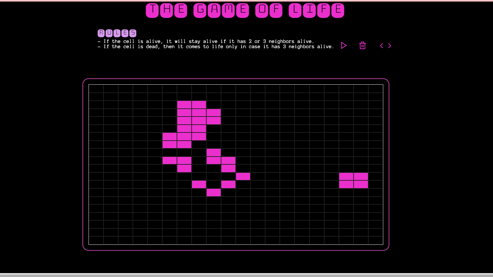

# Conway's Game of Life

The Game of Life, often referred to simply as Life, is a fascinating cellular automaton that exhibits complex behavior emerging from simple rules. Developed by the mathematician John Conway, it requires no further input once initialized, making it a captivating example of emergent phenomena in mathematics and computer science.

## Introduction

In the Game of Life, one interacts by defining an initial configuration of cells and observing how it evolves over generations based on a set of predefined rules.

## Rules:
- **Survival:** A living cell with 2 or 3 neighbors continues to live.
- **Birth:** A dead cell with exactly 3 neighbors becomes alive.

## Features:
- **Visualization:** Witness the mesmerizing patterns and structures that emerge from the interplay of living and dead cells.
- **Customization:** Experiment with different initial configurations to observe various outcomes.
- **Analysis:** Explore the evolution of patterns and understand the underlying principles governing the Game of Life.

Experience the beauty of emergent complexity and dive into the captivating world of Conway's Game of Life.
